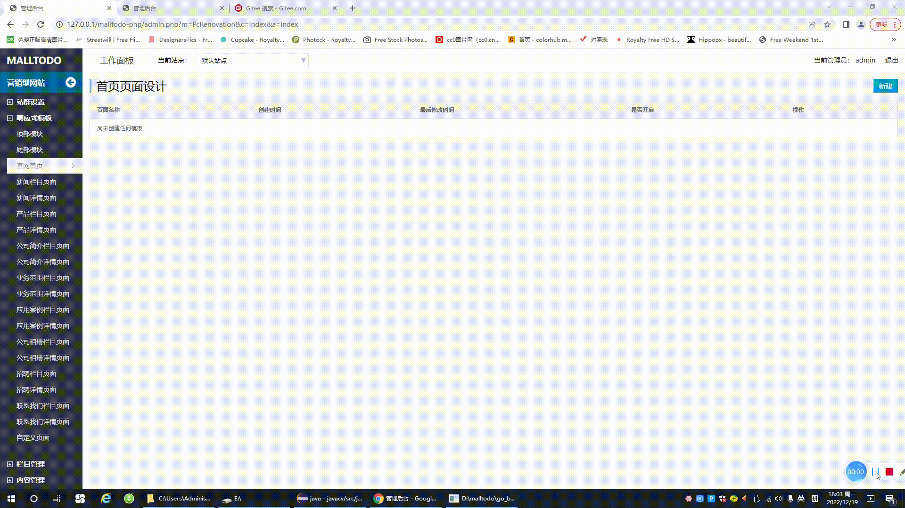
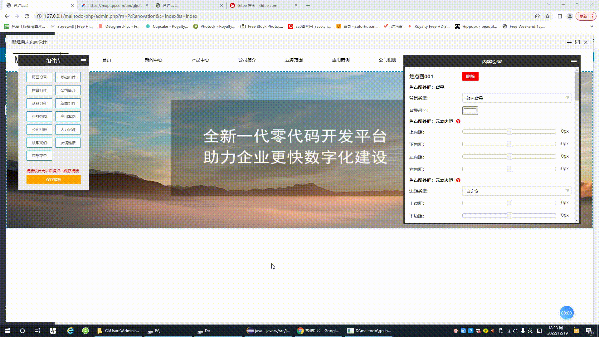
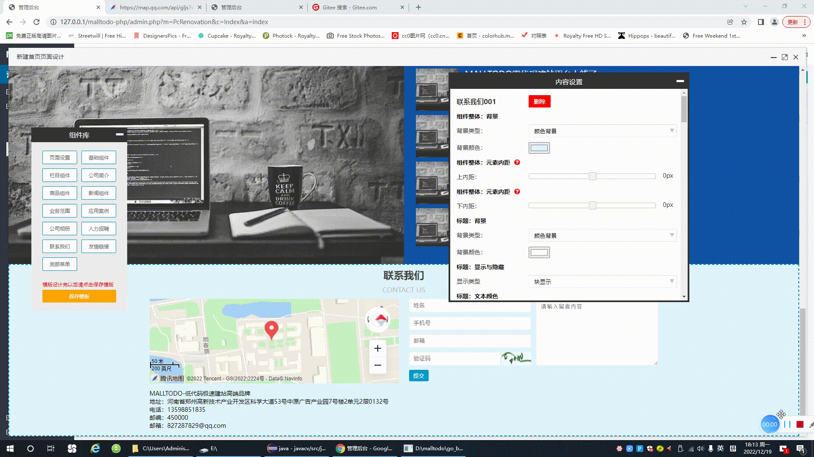

# MALLTODO零代码企业建站系统 V1.2
版权所有 (R) MALLTODO 保留所有权利。

从V1.2版本开始，系统新增了对SQLite数据库的支持，并**将SQLite作为默认数据库**，如果希望继续使用MySQL数据库请将template文件夹删除。（如果存在template文件夹，默认使用SQLite数据库，如果不存在默认使用MySQL数据库。）  

**系统后台地址：http://您的域名/admin.php  默认用户名：admin  默认密码：111111**  

**请将网站的运行目录设置为项目中的entrance目录，其余目录请不要对外暴露，这样可以更加安全。**

感谢您选择MALLTODO零代码企业建站系统（以下简称MALLTODO），MALLTODO由郑州掌勺信息技术有限公司开发，是目前国内强大、稳定的企业网站建设解决方案之一，基于 PHP + MySQL 的技术开发，源码开放。  

MALLTODO零代码建站系统可以帮助用户快速搭建个性化的企业官网，无需专业的编程知识，提供可视化设计器及管理后台，网站的制作过程就像搭积木一样把需要的组件拖拽过来。真正做到“会打字就能建网站”，且所生成的网站均为响应式，支持电脑端，平板，手机等所有设备，还可以嵌入微信公众号，小程序，抖音，快手等平台。  

# 与其他同类型产品的区别

**MALLTODO零代码建站系统不同于市面上其他类似的系统，其他系统大多是基于vue开发的，做出来的网站百度收录不了，这个系统是我们自己研发的模板引擎，可以生成实实在在的html代码，所以百度可以收录，并且可以做SEO优化。**  
  
MALLTODO 的官方网址是： www.malltodo.com

# 免费版与收费版的区别
免费版的组件较少，收费版的组件更为丰富。  

# MALLTODO软件截图

  
  
  
  
  
  
 

# MALLTODO技术交流

  

# MALLTODO协议条款
为了使你正确并合法的使用本软件，请你在使用前务必阅读清楚下面的协议条款：

一、本授权协议适用且仅适用于 MALLTODO V1.x 版本，MALLTODO官方对本授权协议的最终解释权。  

二、协议许可的权利  

1、您可以在完全遵守本最终用户授权协议的基础上，将本软件应用于商业用途，而不必支付软件版权授权费用。

2、您可以在协议规定的约束和限制范围内修改 MALLTODO 源代码或界面风格以适应您的网站要求。

3、您拥有使用本软件构建的网站全部内容所有权，并独立承担与这些内容的相关法律义务。

4、获得商业授权之后，您可以将本软件应用于商业用途，同时依据所购买的授权类型中确定的技术支持内容，自购买时刻起，在技术支持期限内拥有通过指定的方式获得指定范围内的技术支持服务。商业授权用户享有反映和提出意见的权力，相关意见将被作为首要考虑，但没有一定被采纳的承诺或保证。

三、协议规定的约束和限制  

1、未经官方许可，不得对本软件或与之关联的商业授权进行出租、出售、抵押或发放子许可证。

2、未经官方许可，禁止在 MALLTODO 的整体或任何部分基础上以发展任何派生版本、修改版本或第三方版本用于重新分发。

3、如果您未能遵守本协议的条款，您的授权将被终止，所被许可的权利将被收回，并承担相应法律责任。

四、有限担保和免责声明  

1、本软件及所附带的文件是作为不提供任何明确的或隐含的赔偿或担保的形式提供的。

2、用户出于自愿而使用本软件，您必须了解使用本软件的风险，在尚未购买产品技术服务之前，我们不承诺对免费用户提供任何形式的技术支持、使用担保，也不承担任何因使用本软件而产生问题的相关责任。

3、电子文本形式的授权协议如同双方书面签署的协议一样，具有完全的和等同的法律效力。您一旦开始确认本协议并安装 MALLTODO，即被视为完全理解并接受本协议的各项条款，在享有上述条款授予的权力的同时，受到相关的约束和限制。协议许可范围以外的行为，将直接违反本授权协议并构成侵权，我们有权随时终止授权，责令停止损害，并保留追究相关责任的权力。

4、如果本软件带有其它软件的整合API示范例子包，这些文件版权不属于本软件官方，并且这些文件是没经过授权发布的，请参考相关软件的使用许可合法的使用。

协议发布时间： 2021年09月01日

版本最新更新： 2021年09月01日 By malltodo.com
